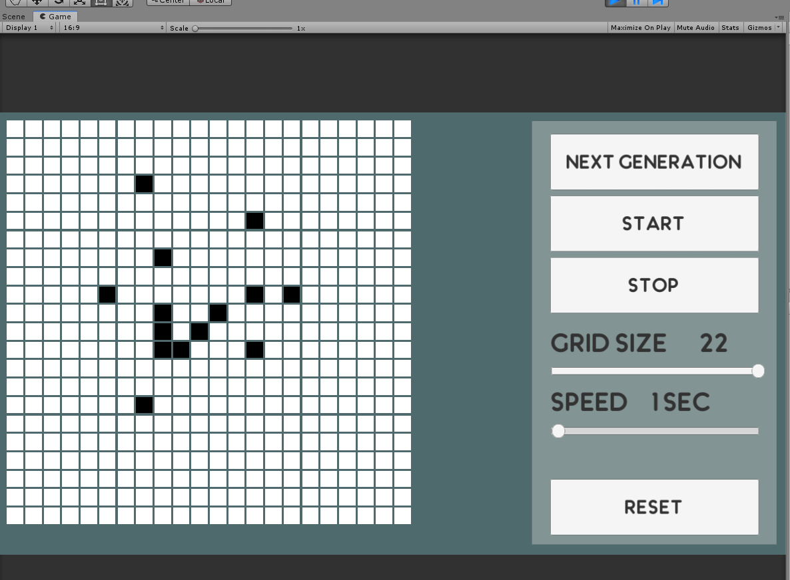
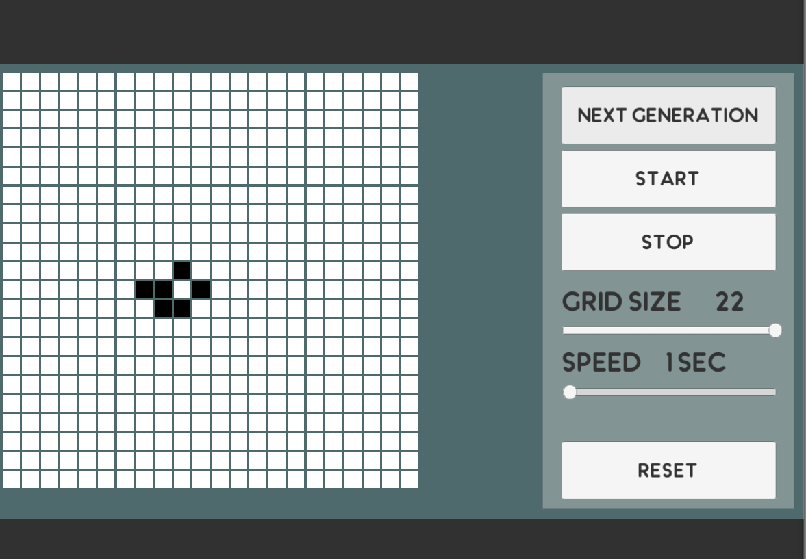

# 🧬 Conway's Game of Life – Unity Desktop Simulator

A simple yet interactive Unity desktop application that simulates **Conway's Game of Life**, a cellular automaton devised by mathematician John Conway. Users can toggle cells, control simulation speed, adjust grid size, and visualize generational evolution in real-time.

---

## 🚀 Features

- 🎛️ Adjustable **grid size** and **simulation speed** via UI sliders
- 👆 Click to toggle cell states (alive/dead)
- ▶️ Start/stop simulation with proper Game of Life rules
- ♻️ Reset and regenerate grids anytime
- 🎨 Live cells appear **black**, dead cells are **white**

---

## 🧠 Game of Life Rules Implemented

- A living cell with fewer than two or more than three living neighbors dies.
- A dead cell with exactly three living neighbors becomes alive.
- All other cells remain in their current state.

---

## 🏗️ Project Structure

```bash
Assets/
│
├── Scripts/
│   ├── UserInputScript.cs       # Handles cell click interactions
│   ├── CellInfo.cs              # Stores and toggles alive/dead state
│   ├── GridGenerator.cs         # Dynamically builds and clears the grid
│   ├── GenerationSimulator.cs   # Core simulation logic for generations
│   └── UIManager.cs             # UI interaction logic (sliders/buttons)
│
└── Prefabs/
    └── CellTile.prefab          # UI tile used to represent a cell
```

---

## 🛠️ Getting Started

### ✅ Prerequisites

Unity (2020.3 LTS or newer recommended)
A system that supports Unity desktop builds

### 📦 Installation

Clone this repository:

Open the project in Unity Editor.

Ensure all UI references are linked in the Inspector (sliders, buttons, prefab, etc.).

Hit Play and start simulating!



